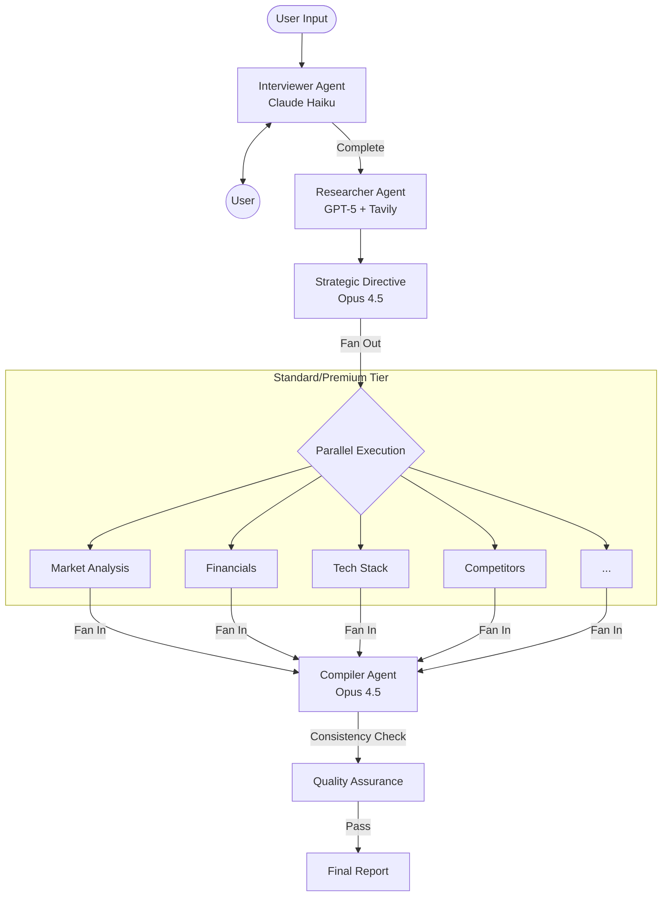

# AI Startup Validation Agent

> A sophisticated, agentic AI system for validating startup ideas. Built on **LangGraph**, it orchestrates a fleet of specialized LLMs (Claude Opus/Sonnet, GPT-5) to interview founders, conduct real-time market research, and generate investor-grade strategic reports.

---

## 🚀 Key Features

### 🧠 Hybrid Brain Architecture
-   **Adaptive Intelligence**: Automatically routes tasks to the most efficient model:
    -   **Claude Haiku 4.5**: Fast, conversational interviews.
    -   **GPT-5-mini**: High-speed synthesis and query generation.
    -   **Claude Sonnet 4.5**: Parallel deep-dive modules (Market, Tech, Finance).
    -   **Claude Opus 4.5**: Strategic reasoning, scoring, and "Go/No-Go" decisions.
-   **Prompt Caching**: Leverages Anthropic's Beta Prompt Caching to reduce costs by 90% for context-heavy tasks.

### ⚡ Performance & Scalability
-   **Parallel Execution**: Uses `asyncio` to run up to 10 analysis modules simultaneously, cutting comprehensive report generation time from ~20m to ~3m.
-   **Reliable "Waterfall" Service**: Custom `LLMService` wrapper provides:
    -   **Automatic Fallback**: Seamlessly switches to Claude if OpenAI fails (and vice-versa).
    -   **Structured Outputs**: Guaranteed valid JSON/Pydantic schemas for all agent outputs.

### 🛡️ Robust Validation Workflow
-   **Self-Healing**: "Compiler" agent detects contradictions between modules (e.g., Market vs. Finance) and auto-corrects them before reporting.
-   **Strategic Directive**: Generates a "Truth Document" early in the pipeline to ensure all concurrent agents align on the startup's core strategy.

---

## 🛠 Tech Stack

-   **Orchestration**: [LangGraph](https://github.com/langchain-ai/langgraph) (Stateful Multi-Agent Workflows)
-   **Agents**: [LangChain](https://github.com/langchain-ai/langchain)
-   **API**: FastAPI (Python 3.13+)
-   **Runtime Management**: `uv` (Fast Python Package Installer)
-   **Search**: Tavily API (Real-time web research)
-   **Database**: PostgreSQL (Checkpointing)
-   **Containerization**: Docker & Docker Compose

---

## 🏗 Architecture

### The Workflow Graph

The system is modeled as a directed cyclic graph (DAG) in `src/graph/workflow.py`.



### State Management (`ValidationState`)
All agents read from and write to a shared "Blackboard" state:
-   **Inputs**: Description, Tier
-   **Context**: Interview Transcript, Research Data
-   **Outputs**: Module Results, Final Report
This allows the process to be paused (e.g., for payment) and resumed without data loss.

---

## 🚦 Getting Started

### Prerequisites

-   **Python 3.13+**
-   **uv**: `curl -LsSf https://astral.sh/uv/install.sh | sh`
-   **Docker** (Optional, for production)

### Local Development

1.  **Clone the Repository**
    ```bash
    git clone https://github.com/your-org/validator-ai.git
    cd validator-ai
    ```

2.  **Install Dependencies**
    We use `uv` for lightning-fast dependency management.
    ```bash
    uv sync
    ```

3.  **Environment Configuration**
    Copy the example template and fill in your keys.
    ```bash
    cp .env.example .env
    ```

    | Variable | Description | Required | 
    |----------|-------------|----------|
    | `OPENAI_API_KEY` | Primary LLM Provider | ✅ |
    | `ANTHROPIC_API_KEY` | Secondary/Fallback Provider | ✅ |
    | `TAVILY_API_KEY` | Search Provider | ✅ |
    | `USE_MEMORY_SAVER` | Set to `true` for local dev (no Postgres needed) | ⚠️ |

4.  **Run the Server**
    ```bash
    # Set to use in-memory checkpointer for dev
    export USE_MEMORY_SAVER=true
    
    # Run via uv
    uv run uvicorn app:app --reload --port 8000
    ```

5.  **Test the API**
    Open [http://localhost:8000/docs](http://localhost:8000/docs) to see the Swagger UI.

---

## 📦 Service Tiers

| Feature | Free | Basic | Standard | Premium |
|:---|:---:|:---:|:---:|:---:|
| **Word Count** | ~300 | ~1,500 | ~25k | ~25k |
| **Model** | Sonnet 4.5 | Sonnet 4.5 | **Opus 4.5** | **Opus 4.5** |
| **Modules** | Viability | BMC | 10 Deep Dives | 10 Deep Dives |
| **Pitch Deck** | ❌ | ❌ | ❌ | ✅ |
| **Human Review**| ❌ | ✅ | ✅ | ✅ |

---

## 🧪 Testing

The project uses `pytest` for testing.

### Run All Tests
```bash
uv run pytest
```

### Specific Test Suites
-   **Workflow Logic**: Verify routing and state transitions.
    ```bash
    uv run pytest tests/test_workflow.py
    ```
-   **Agent Logic**: Test individual agent prompts and parsing.
    ```bash
    uv run pytest tests/test_agents.py
    ```
-   **Integration**: Test the full API flow.
    ```bash
    uv run pytest tests/test_api.py
    ```

---

## 🐳 Deployment

For production, use the included Docker Compose setup.

1.  **Build & Run**
    ```bash
    docker compose up --build -d
    ```

2.  **Database Migration**
    The app uses LangGraph's Postgres checkpointer implicitly. Ensure the `DATABASE_URL` in `.env` points to the postgres container.
